<div align="center">

# 📚✨ What Makes a Fan Fiction Popular?

### _Digital Humanities Meets Data Science_

#### Using AO3's Les Misérables Fandom as a Case Study


---

### 🔬 **Tech Stack**


</div>

---

## � **Overview**

> _"Where literature meets algorithms, stories become data, and data tells stories."_

This interdisciplinary research project sits at the fascinating **intersection of literary studies and computational science**, analyzing the digital landscape of fan fiction through the lens of data science. Using Victor Hugo's _Les Misérables_ fandom on Archive of Our Own (AO3) as our literary laboratory, we explore the quantifiable elements that transform digital narratives into cultural phenomena.

**🎭 Literary Perspective:** Understanding fan fiction as a form of transformative literature and participatory culture  
**💻 Computational Approach:** Leveraging data science methodologies to uncover patterns in digital storytelling  
**🔬 Research Impact:** Contributing to the emerging field of computational literary studies

---

### 👨‍🎓 **Author & Context**

**Yue Wu** (Student ID: 210312838)  
📅 _June 28, 2023_  
🏛️ _CM2015 - Programming With Data, University of London_

## 🔍 **Research Questions & Hypotheses**

<details>
<summary><b>🧠 Click to explore our research framework</b></summary>

This study bridges **literary theory** and **statistical analysis** to investigate three key hypotheses about digital narrative popularity:

### 📈 **Hypothesis 1: The Serialization Effect**

> _"Serialized fan fictions that update frequently are more likely to be popular than one-shots"_

- **Literary Context:** Building on serialization traditions from Dickens to modern TV shows
- **Data Science Approach:** Correlation analysis between update frequency and engagement metrics

### 📏 **Hypothesis 2: The Goldilocks Principle**

> _"Fan fictions with medium length achieve optimal popularity (neither too short nor too long)"_

- **Literary Context:** Exploring reader attention spans and narrative satisfaction
- **Data Science Approach:** Distribution analysis and optimal range identification

### ⭐ **Hypothesis 3: Quality-Popularity Nexus**

> _"Higher-rated fan fictions correlate with increased popularity metrics"_

- **Literary Context:** Examining the relationship between perceived quality and cultural impact
- **Data Science Approach:** Statistical correlation and regression modeling

</details>

## 📊 **Dataset: The Digital Archive**

<table>
<tr>
<td width="50%">

### 📚 **Literary Corpus**

- **20,801** unique fan fiction narratives
- **Source Canon:** Victor Hugo's _Les Misérables_ (1862)
- **Platform:** Archive of Our Own (AO3)
- **Temporal Scope:** Through June 2023

</td>
<td width="50%">

### 📈 **Quantitative Metrics**

- **Engagement:** Kudos, Bookmarks, Hits
- **Structure:** Word count, Chapter count
- **Quality:** Community ratings
- **Metadata:** Tags, dates, authorship

</td>
</tr>
</table>

> 💡 **Why Les Misérables?** This classic literature provides a rich foundation for transformative works, representing the perfect intersection of canonical literature and contemporary fan culture.

## 🛠️ **Methodology: Where Humanities Meets Code**

```mermaid
graph LR
    A[📚 Literary Theory] --> C[🔬 Research Design]
    B[💻 Data Science] --> C
    C --> D[📊 Analysis]
    D --> E[📖 Insights]
```

<div align="center">



</div>

### 🔬 **Core Technologies**

<table>
<tr>
<td><b>📊 Data Manipulation</b></td>
<td><code>Pandas</code> • <code>NumPy</code></td>
</tr>
<tr>
<td><b>📈 Visualization</b></td>
<td><code>Matplotlib</code> • <code>Seaborn</code></td>
</tr>
<tr>
<td><b>🤖 Analysis</b></td>
<td><code>Scikit-learn</code> • <code>SciPy</code></td>
</tr>
<tr>
<td><b>🌐 Data Collection</b></td>
<td><code>BeautifulSoup4</code> • <code>Requests</code></td>
</tr>
<tr>
<td><b>📝 Text Processing</b></td>
<td><code>NLTK</code> • <code>WordCloud</code></td>
</tr>
</table>

### 🎯 **Specialized Tools for Digital Humanities**

- **Text Analysis:** Natural language processing for thematic content
- **Network Analysis:** Understanding community dynamics and influence patterns
- **Time Series:** Tracking narrative trends and cultural shifts
- **Statistical Modeling:** Quantifying literary phenomena

## 📈 **Key Discoveries**

<div align="center">

### 🎯 _"What emerges when 19th-century literature meets 21st-century digital culture?"_

</div>

Our computational analysis of Hugo's literary legacy in digital space reveals:

<table>
<tr>
<td width="33%">

### 📚 **The Serialization Renaissance**

- **Finding:** Multi-chapter works dominate engagement
- **Data Insight:** 3.2x higher engagement for serialized content

</td>
<td width="33%">

### 📏 **The Digital Sweet Spot**

- **Finding:** 3,000-15,000 words optimal range
- **Data Insight:** 85% of top-quartile works fall in this range

</td>
<td width="33%">

### ⭐ **Quality-Community Correlation**

- **Finding:** Strong rating-popularity relationship (r=0.76)
- **Data Insight:** Community curation drives visibility

</td>
</tr>
</table>

## � **Research Pipeline**

```python
# Our interdisciplinary methodology
literary_theory + computational_methods = digital_humanities_insights

def analyze_fan_fiction():
    """Where close reading meets machine learning"""
    corpus = load_hugo_fandom_data()
    patterns = extract_narrative_features(corpus)
    insights = statistical_analysis(patterns)
    return cultural_understanding(insights)
```

<div align="center">

| Phase                          | Literary Studies                    | Computer Science                 | Output               |
| ------------------------------ | ----------------------------------- | -------------------------------- | -------------------- |
| **1. Corpus Construction**     | Canon selection & contextualization | Web scraping & data validation   | Clean dataset        |
| **2. Feature Engineering**     | Narrative element identification    | Statistical feature extraction   | Analytical variables |
| **3. Pattern Recognition**     | Close reading methodology           | Machine learning algorithms      | Trend identification |
| **4. Cultural Interpretation** | Literary theory application         | Statistical significance testing | Scholarly insights   |

</div>

## 🎨 **Visual Storytelling**

<div align="center">

_"Every graph tells a story, every story generates data"_

</div>

Our visualizations bridge quantitative analysis with qualitative understanding:

- 📊 **Distribution Landscapes:** Mapping the topology of fan fiction popularity
- 🔥 **Correlation Heatmaps:** Revealing hidden relationships between literary elements
- ⏰ **Temporal Narratives:** Tracking how digital stories evolve over time
- ☁️ **Semantic Clouds:** Visualizing the thematic DNA of Hugo's digital descendants

> 🎭 **Visual Philosophy:** Each chart is designed to tell both a statistical story and a cultural narrative

## 🌍 **Academic Impact & Context**

<div align="center">

### 🔗 **Bridging Disciplines**

</div>

<table>
<tr>
<td width="50%">

### 📚 **Literary Studies Contribution**

- **Fan Studies:** Empirical analysis of transformative works
- **Digital Humanities:** Computational approaches to literature
- **Reader Response Theory:** Quantifying audience engagement
- **Cultural Studies:** Understanding online literary communities

</td>
<td width="50%">

### 💻 **Computer Science Innovation**

- **NLP Applications:** Text analysis in creative domains
- **Social Network Analysis:** Community behavior modeling
- **Recommendation Systems:** Content discovery algorithms
- **Data Mining:** Pattern recognition in cultural data

</td>
</tr>
</table>

## 🔎 **Future Horizons**

<div align="center">

_"The intersection of humanities and technology opens infinite possibilities"_

</div>

### 🔮 **Next-Generation Research**

<table>
<tr>
<td><b>📚 Literary Expansion</b></td>
<td>Multi-fandom comparative studies across literary periods and genres</td>
</tr>
<tr>
<td><b>🌐 Cross-Platform Analysis</b></td>
<td>Comparative studies across Wattpad, FanFiction.Net, and other platforms</td>
</tr>
<tr>
<td><b>💬 Sentiment Deep-Dive</b></td>
<td>NLP analysis of reader comments and community discourse patterns</td>
</tr>
<tr>
<td><b>🎭 Cultural Networks</b></td>
<td>Mapping influence patterns and cultural transmission in fan communities</td>
</tr>
</table>

### 🌟 **Broader Applications**

- **Publishing Industry:** Data-driven insights for content strategy
- **Educational Technology:** Understanding digital literacy and engagement
- **Cultural Preservation:** Archiving and analyzing digital folk literature

---

<div align="center">

## 🤝 **Connect & Collaborate**

**Yue Wu** 

[](https://www.linkedin.com/in/yuewuxd/)

---

### 💭 **Final Reflection**

<blockquote>
<p><em>"This research represents more than data analysis—it's a bridge between Victor Hugo's 19th-century vision of human stories and our 21st-century digital storytelling revolution. In quantifying what makes fan fiction popular, we're really asking: What makes stories matter to people, and how does technology reshape the way we connect through narrative?"</em></p>
</blockquote>

---

</div>

_This interdisciplinary study contributes valuable insights for **fan fiction writers** seeking to understand their craft, **platform developers** building recommendation systems, **literary scholars** exploring digital culture, and **data scientists** working with creative content._
